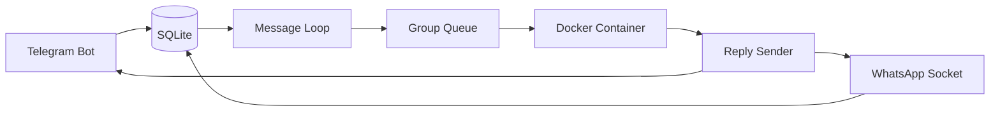
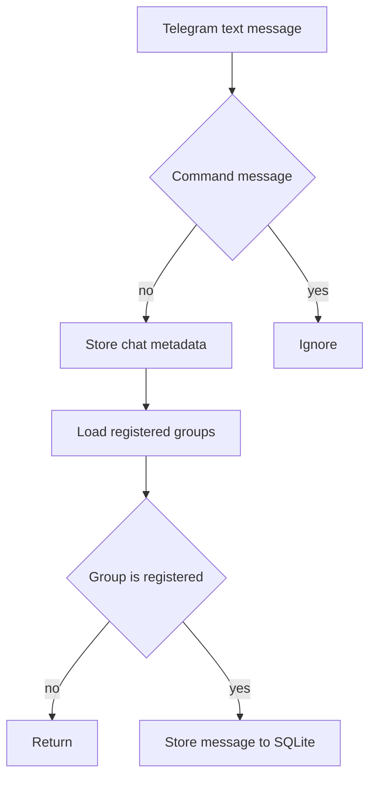
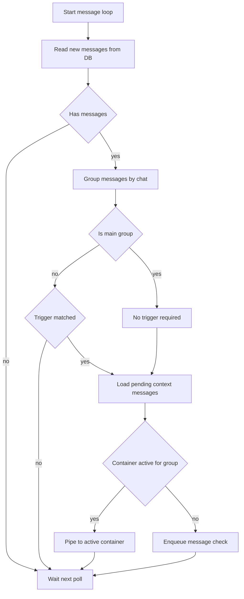
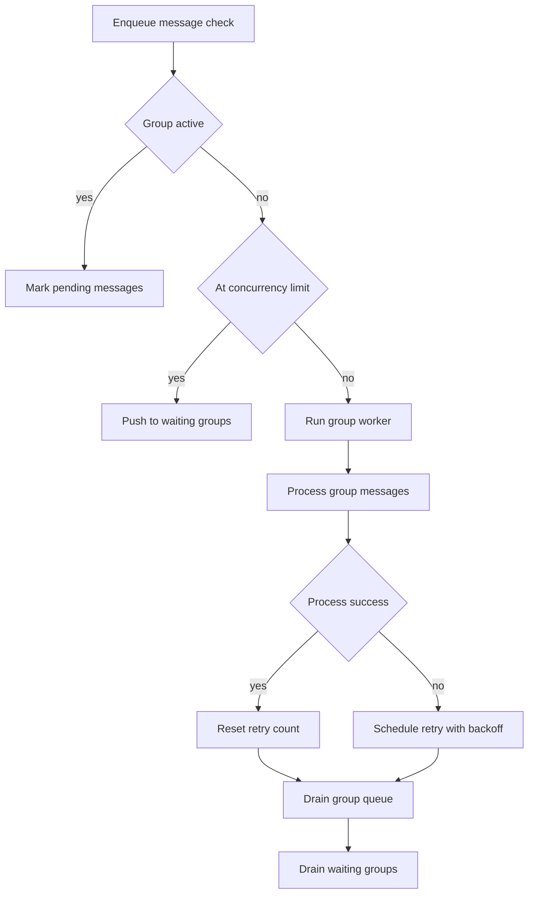
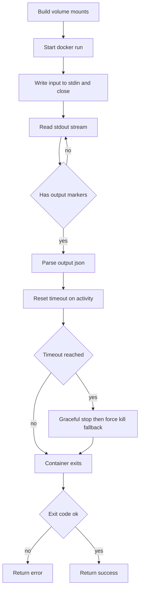

# NanoClaw 消息处理流程图

本文档用于快速理解 NanoClaw 从消息进入到容器执行并回发结果的完整路径。

## 1. 总体架构图

对应代码：
- Telegram 入口：`src/telegram.ts`
- Message Loop：`src/index.ts` 的 `startMessageLoop`
- Queue：`src/group-queue.ts`
- Container：`src/container-runner.ts`

## 2. 消息存储流程（生产者）

对应代码：
- 入口：`src/telegram.ts` `bot.on("message:text")`
- 注册检查：`registeredGroups[chatId]`
- 入库：`storeMessageDirect`

## 3. 消息处理流程（消费者）

对应代码：
- 轮询：`src/index.ts` `startMessageLoop`
- 读取：`src/db.ts` `getNewMessages`
- 触发词：`TRIGGER_PATTERN.test`
- Main 判定：`group.folder === MAIN_GROUP_FOLDER`
- 复用容器：`queue.sendMessage`
- 新建处理：`queue.enqueueMessageCheck`

## 4. 队列管理流程（GroupQueue）

对应代码：
- 并发上限：`src/config.ts` `MAX_CONCURRENT_CONTAINERS`
- 执行入口：`src/group-queue.ts` `runForGroup`
- 重试：`src/group-queue.ts` `scheduleRetry`

## 5. 容器执行流程（runContainerAgent）

对应代码：
- 容器入口：`src/container-runner.ts` `runContainerAgent`
- 输入：`container.stdin.write` 和 `container.stdin.end`
- 输出：`OUTPUT_START_MARKER` 与 `OUTPUT_END_MARKER`
- 超时：`CONTAINER_TIMEOUT` 与 `killOnTimeout`

## 6. 关键代码位置表（调试速查）

| 功能 | 位置 |
|---|---|
| Telegram 文本消息入口 | `src/telegram.ts` (`bot.on("message:text")`) |
| Telegram 注册群检查 | `src/telegram.ts` (`registeredGroups[chatId]`) |
| Telegram 入库 | `src/telegram.ts` (`storeMessageDirect`) |
| 轮询主循环 | `src/index.ts` (`startMessageLoop`) |
| 拉取新消息 | `src/db.ts` (`getNewMessages`) |
| 触发词判定 | `src/index.ts` (`TRIGGER_PATTERN.test`) |
| Main 群判定 | `src/index.ts` (`group.folder === MAIN_GROUP_FOLDER`) |
| 复用活跃容器 | `src/index.ts` -> `queue.sendMessage(...)` |
| 启动排队新容器 | `src/index.ts` -> `queue.enqueueMessageCheck(...)` |
| 队列并发控制 | `src/group-queue.ts` (`MAX_CONCURRENT_CONTAINERS`) |
| 群组执行入口 | `src/group-queue.ts` (`runForGroup`) |
| 实际群消息处理 | `src/index.ts` (`processGroupMessages`) |
| 重试机制 | `src/group-queue.ts` (`scheduleRetry`) |
| 容器启动执行 | `src/container-runner.ts` (`runContainerAgent`) |
| stdin 输入 | `src/container-runner.ts` (`container.stdin.write/end`) |
| stdout 流式解析 | `src/container-runner.ts` (`OUTPUT_START/END` 解析) |
| 超时与优雅关闭 | `src/container-runner.ts` (`killOnTimeout`, `docker stop`) |

## 验证方式

- VS Code：安装 Mermaid 插件后打开 `docs/message-flow.md` 预览。
- GitHub：直接查看该 Markdown 文件，Mermaid 图可自动渲染。
